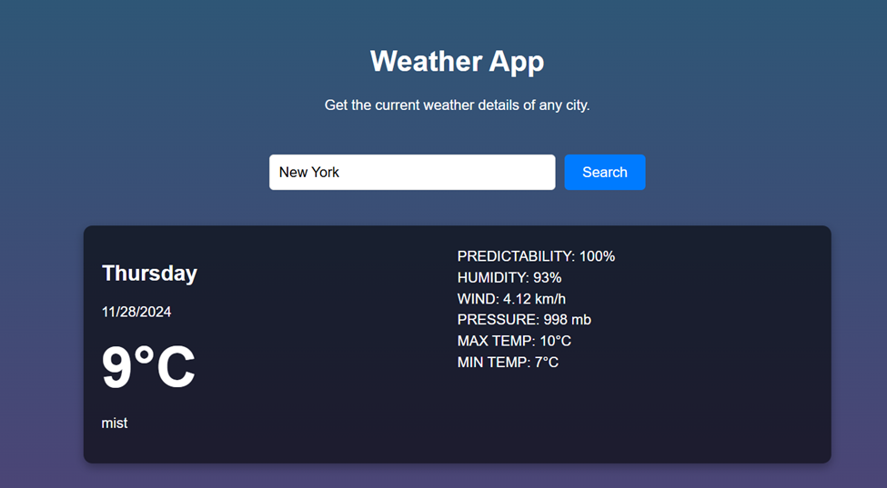
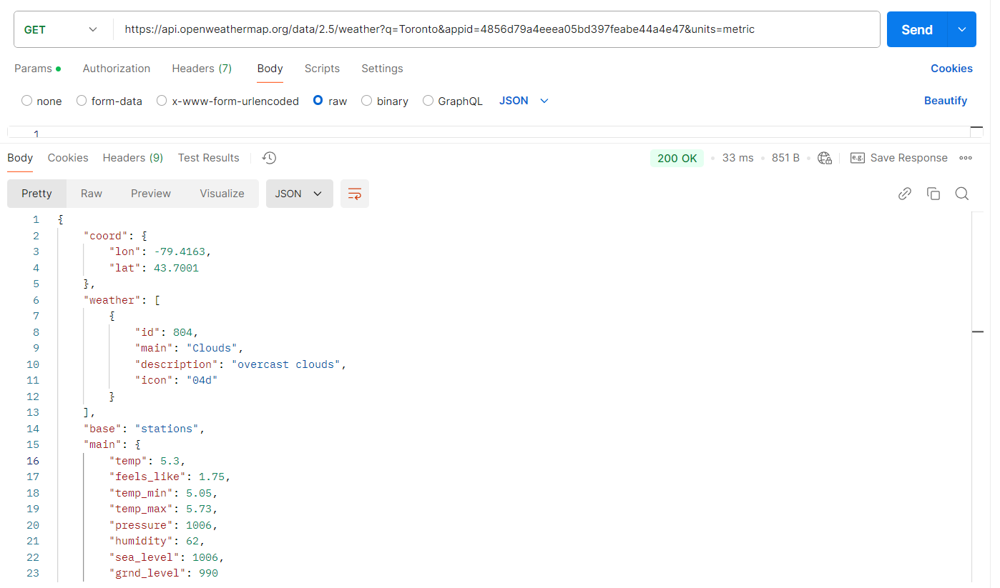

# Weather App
This is a React weather application that fetches real-time weather data using the OpenWeather API.

## Features
- View current weather for any city.
- Dynamic search functionality.
- Displays temperature, humidity, weather condition.

# App Output

# Postman Output

